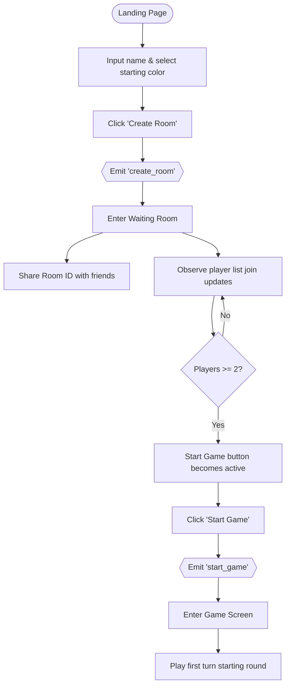
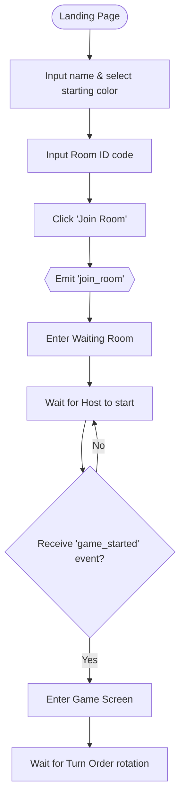
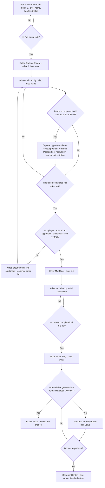
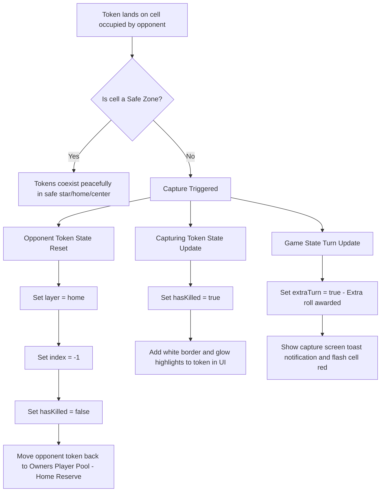

# Chowkabara Game Documentation & Flow Specifications

Welcome to the comprehensive guide and specification documentation for the local **Chowkabara** multiplayer board game. This document outlines the complete game lifecycle, states, rules, UI design implementations, and flow diagrams.

---

## 1. Game Overview & Core Rules

**Chowkabara** is a traditional Indian board game played on a 7x7 grid. Players roll a virtual dice to enter their pieces onto the board, capture opponent pieces, navigate three concentric rings (Outer, Middle, Inner), and reach the center cell to win.

### Core Gameplay Flow:
1. **Starting Point**: Every player begins with all 6 of their respective colored pieces in their side reserve pool.
2. **First Turn**: The game is started by the room creator, and the turn rotates clockwise among active players.
3. **Entering the Board**: Players roll the dice. Only rolling a **6** allows a player to enter a piece onto their starting outer cell (or move an already active piece) and grants an extra roll.
4. **Capturing (Killing) Requirement**: Before a piece can leave the outer ring and enter the middle ring, it **must capture (kill) at least one opponent piece**. If it reaches the lap end without a capture, it wraps around the outer ring for another lap.
5. **Autoprogression**: Once a capture has been made, the piece transitions to the middle ring, and automatically progresses to the inner ring and center cell without further capture conditions.
6. **Inner Ring & Exact Roll Limits**: Within the inner ring, the steps to reach the center are calculated strictly:
   - If the rolled dice exceeds the exact steps to reach the center, the move is invalid (forfeited).
   - If the roll is less than or equal to the steps, it moves closer or finishes.
7. **Win Condition**: The first player to successfully move all 6 tokens to the center cell is declared the winner.

---

## 2. Graphic Game Loop Infographic
A premium graphic flowchart showing the overall game loop and transitions is saved in your artifacts folder:
- **Infographic File**: [chowkabara_flow_diagram.png](chowkabara_flow_diagram.png)

---

## 3. Detailed Game Flow Diagrams

### Diagram A: Creator's Game Flow Diagram
This shows the sequence of actions and state progression for the room creator/host.

---

### Diagram B: Joined Player Flow Diagram
This shows the progression of screens and events for guest players joining an existing room.

---

### Diagram C: Piece Life Cycle Diagram
This tracks the exact states, constraints, and transition rules for a single token.

---

### Diagram D: Capture (Kill) Event & Token Reset Flow
This shows what happens to both the capturing token and the captured token during a capture event.

> [!NOTE]
> A premium graphic flowchart of the capture event has been generated and saved directly in your artifacts folder as [chowkabara_capture_diagram.png](chowkabara_capture_diagram.png).

---

### Diagram E: Full Server Lifecycle & Event Flow
This tracks the Socket.IO events, backend room mappings, and client synchronization.

```mermaid
sequenceDiagram
    autonumber
    actor Creator
    actor JoinedPlayer
    participant Server as Flask Game Server
    participant Storage as Rooms JSON Storage

    %% Room Creation
    Creator->>Server: emit("create_room", { name, color })
    Server->>Storage: Initialize Room State & empty Game State
    Server-->>Creator: emit("room_created", { room })

    %% Player Joins
    JoinedPlayer->>Server: emit("join_room", { name, room_id, color })
    Server->>Storage: Add player to Room
    Server-->>Creator: emit("player_joined", { room })
    Server-->>JoinedPlayer: emit("room_joined", { room })

    %% Game Start
    Creator->>Server: emit("start_game", { room_id })
    Server->>Server: Compute clockwise turnOrder starting with Creator
    Server->>Storage: Set status to "playing" & save state
    Server-->>Creator: emit("game_started", { room })
    Server-->>JoinedPlayer: emit("game_started", { room })

    %% Turn Execution
    rect rgb(20, 30, 40)
        Note over Creator, Server: Active Turn Execution Loop
        Creator->>Server: emit("sync_game_state", { room_id, gameState })
        Server->>Storage: Update game state JSON
        Server-->>JoinedPlayer: emit("game_state_updated", { gameState })
    end

    %% Reconnection / Session recovery
    JoinedPlayer->>Server: emit("rejoin_room", { uid })
    alt Room Exists
        Server-->>JoinedPlayer: emit("room_joined", { room, rejoined: true })
    else Room Deleted
        Server-->>JoinedPlayer: emit("rejoin_failed")
    end
```

---

## 4. UI Design & Interactive Polish Features

To make the game smooth and visually responsive, the following enhancements are fully integrated:
1. **Interactive Path Highlighting**: When hovering over a playable piece, the destination grid cell lights up with an amber glow, allowing players to preview their landing cell before making a move.
2. **Pulsing Turn Indicator**: The active player profile card breathes with a glowing pulse, making turn changes clear.
3. **Step-by-Step Piece Animation**: Active tokens hop cell-by-cell along their path (180ms delay per cell step) during movement, illustrating the exact route traveled.
