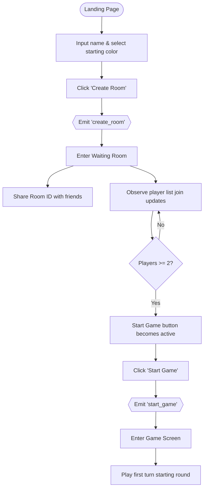
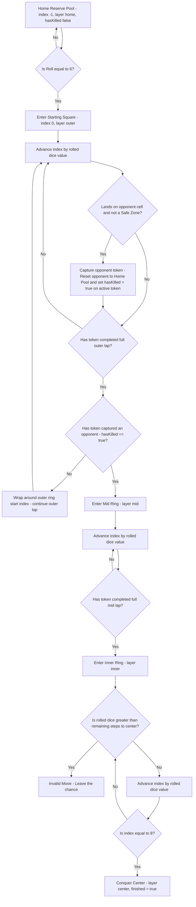
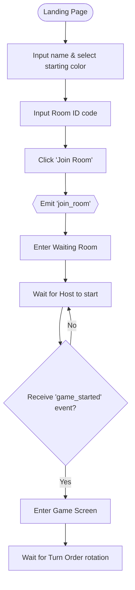
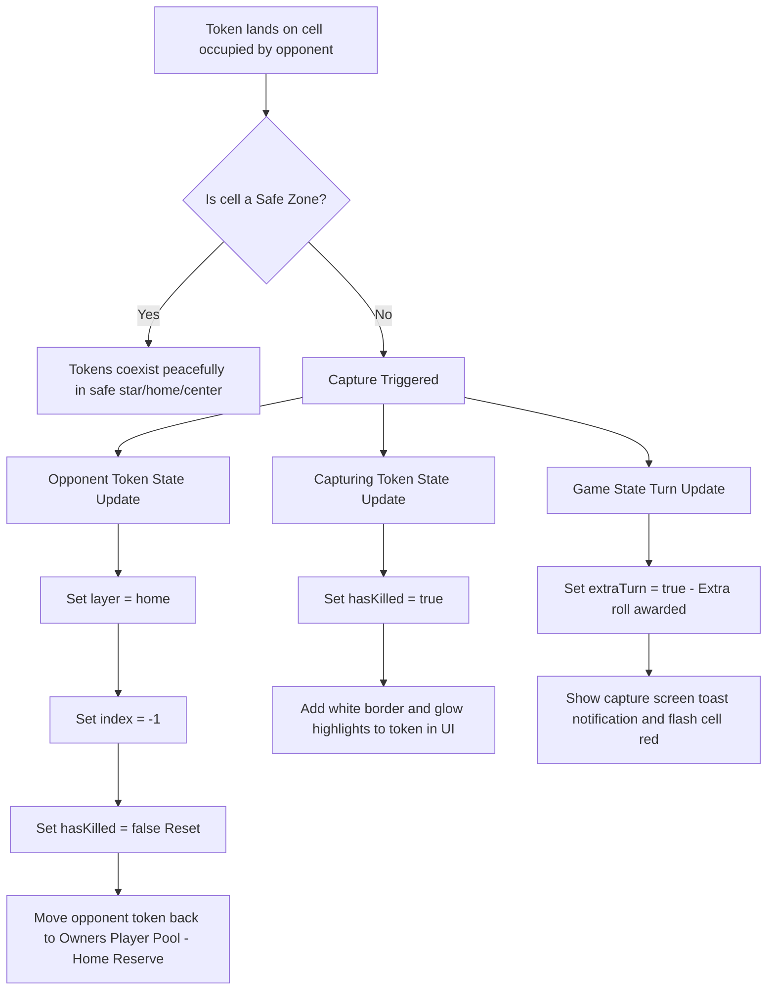

# Chowkabara Workflow Diagrams

> [!NOTE]
> A premium graphic flowchart of the game rules has been generated and saved directly in your artifacts folder as [chowkabara_flow_diagram.png](chowkabara_flow_diagram.png).

This document contains visual workflow diagrams representing the creators' flow, joined players' flow, piece lifecycles, and backend server architecture using Mermaid diagrams.

---

## 1. Creator's Game Flow Diagram

---

## 2. Piece Life Cycle Diagram

---

## 3. Joined Player Flow Diagram

---

## 4. Full Server Lifecycle & Event Flow

```mermaid
sequenceDiagram
    autonumber
    actor Creator
    actor JoinedPlayer
    participant Server as Flask Game Server
    participant Storage as Rooms JSON Storage

    %% Room Creation
    Creator->>Server: emit("create_room", { name, color })
    Server->>Storage: Initialize Room State & empty Game State
    Server-->>Creator: emit("room_created", { room })

    %% Player Joins
    JoinedPlayer->>Server: emit("join_room", { name, room_id, color })
    Server->>Storage: Add player to Room
    Server-->>Creator: emit("player_joined", { room })
    Server-->>JoinedPlayer: emit("room_joined", { room })

    %% Game Start
    Creator->>Server: emit("start_game", { room_id })
    Server->>Server: Compute clockwise turnOrder starting with Creator
    Server->>Storage: Set status to "playing" & save state
    Server-->>Creator: emit("game_started", { room })
    Server-->>JoinedPlayer: emit("game_started", { room })

    %% Turn Execution
    rect rgb(20, 30, 40)
        Note over Creator, Server: Active Turn Execution Loop
        Creator->>Server: emit("sync_game_state", { room_id, gameState })
        Server->>Storage: Update game state JSON
        Server-->>JoinedPlayer: emit("game_state_updated", { gameState })
    end

    %% Reconnection / Session recovery
    JoinedPlayer->>Server: emit("rejoin_room", { uid })
    alt Room Exists
        Server-->>JoinedPlayer: emit("room_joined", { room, rejoined: true })
    else Room Deleted
        Server-->>JoinedPlayer: emit("rejoin_failed")
    end
```

---

## 5. Capture (Kill) Event & Token Reset Flow

> [!NOTE]
> A premium graphic flowchart of the capture event has been generated and saved directly in your artifacts folder as [chowkabara_capture_diagram.png](chowkabara_capture_diagram.png).

